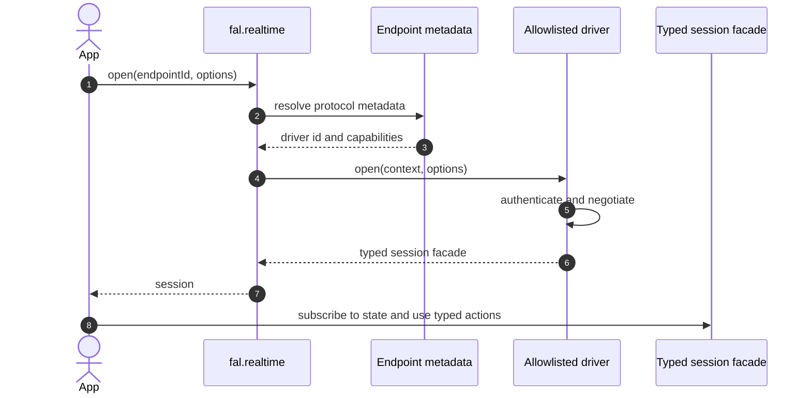
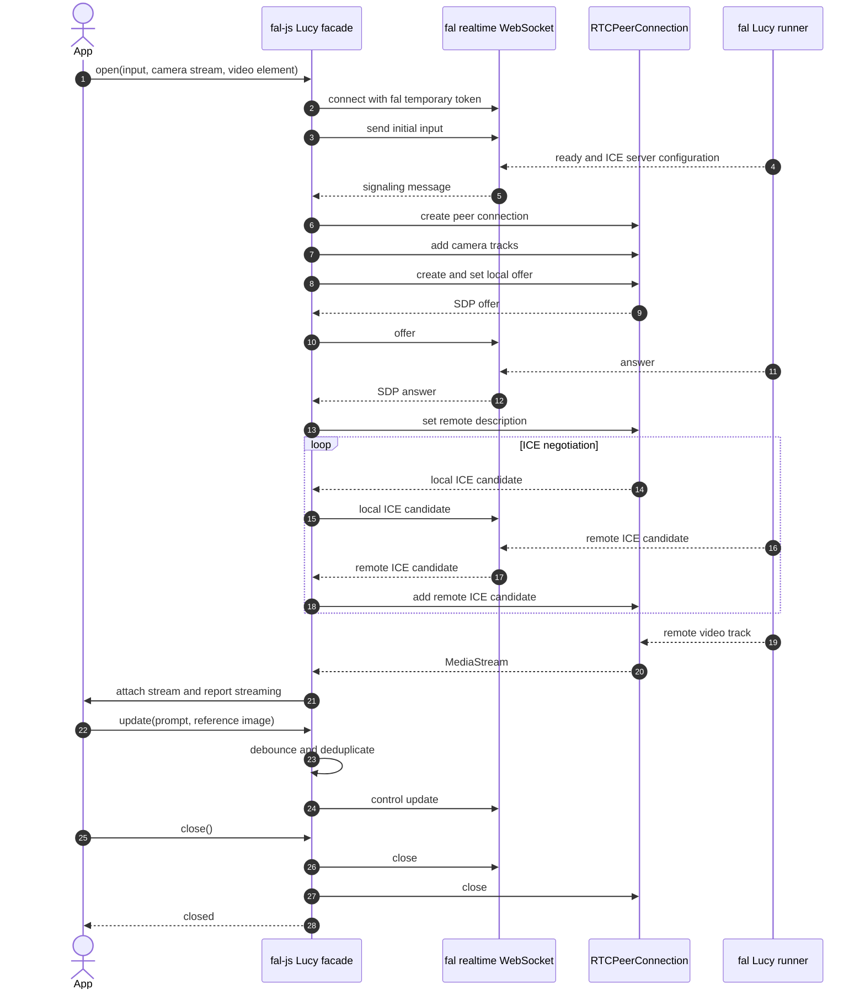
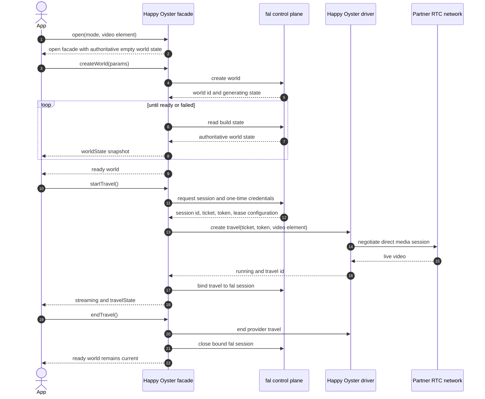
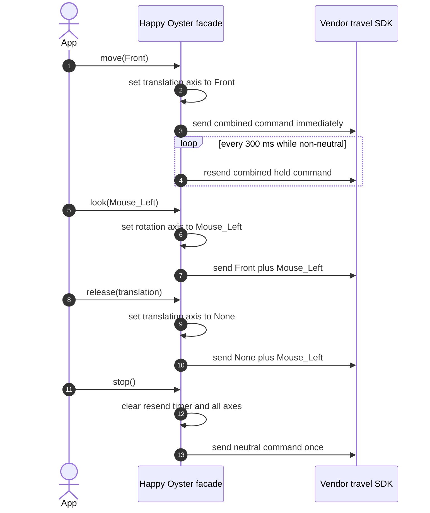
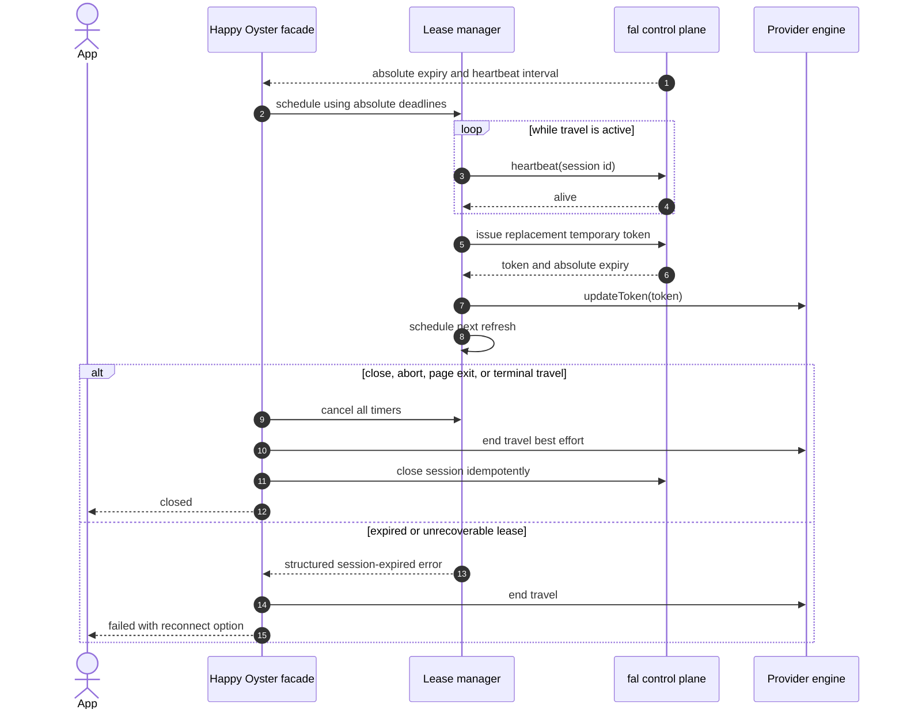

# Realtime world-model sessions in fal-js

<!-- cspell:words autonumber bioluminescent decart hostnames idempotency idempotently webrtc -->

Status: **Proposal**

This document proposes a client contract and implementation boundary for
realtime world models in fal-js. It is intentionally documentation-only. It
does not commit the repository to the exact names or wire schemas shown below.

## Summary

fal currently exposes `fal.realtime.connect()` as a low-level WebSocket client.
That primitive is useful, but it does not own higher-level concerns such as
WebRTC negotiation, media attachment, persistent-world preparation, provider
credentials, heartbeat leases, model controls, or coordinated teardown.

Those concerns have consequently moved into individual applications:

- Lucy 2.5 uses a fal WebSocket as a WebRTC signaling channel. The playground
  creates the peer connection, routes offer/answer/ICE messages, attaches
  media, and forwards selected form updates.
- Happy Oyster uses fal as a control plane, then connects the browser directly
  to a partner RTC network through a vendor SDK. The playground currently owns
  world creation and polling, ticket exchange, temporary-token renewal,
  heartbeats, travel binding, controls, teardown, and artifacts.

The proposal is:

1. Preserve `fal.realtime.connect()` as the raw, backwards-compatible
   WebSocket API.
2. Add a protocol-aware `fal.realtime.open()` entrypoint.
3. Implement transport and model differences behind allowlisted drivers.
4. Return typed model facades for known world models rather than reducing
   every model to a generic `send()` method.
5. Keep provider SDKs in a first-party WMA driver bundle instead of adding
   every provider dependency to the base client.
6. Let endpoint metadata select a driver and describe capabilities once the
   contract has been validated with real implementations.

The guiding rule is:

> fal-js owns the session, drivers own negotiation, and applications own
> presentation.

## Motivation

The current `RealtimeConnection` returns only `send()` and `close()`. It
handles fal authentication, WebSocket connection reuse, encoding, decoding,
and token refresh, but intentionally has no concept of:

- asynchronous readiness;
- connection or media state;
- WebRTC signaling;
- published or subscribed tracks;
- long-lived provider leases;
- persistent worlds;
- model-specific actions;
- coordinated cleanup across multiple resources.

The missing layer is visible in recent web-app work:

- [Lucy 2.5 playground support](https://github.com/fal-ai/web-app/pull/6446)
  registered the endpoint in hard-coded field, debounce, and mirroring tables.
- [WebRTC form forwarding](https://github.com/fal-ai/web-app/pull/4932)
  added live-update behavior directly to the shared playground action.
- [Happy Oyster's playground](https://github.com/fal-ai/web-app/pull/6580)
  added a complete provider-specific lifecycle to the web application.
- [Happy Oyster held controls](https://github.com/fal-ai/web-app/pull/6593)
  demonstrated that even input delivery semantics can be model-specific: a
  held command must be resent every 300 ms because one command applies to one
  generation chunk.

The published
[`@reactor-models/happy-oyster`](https://www.npmjs.com/package/@reactor-models/happy-oyster)
SDK is a useful behavioral reference. It combines a generic Reactor session
with a typed Happy Oyster facade and exposes a linear workflow:

```text
connect
  -> createWorld or attachWorld
  -> startTravel
  -> control
  -> endTravel
  -> disconnect
```

That is a better public abstraction for Happy Oyster than exposing tickets,
poll endpoints, vendor engine instances, or a lowest-common-denominator
`invoke()` API.

## Goals

- Give application developers one fal entrypoint for protocol-aware realtime
  sessions.
- Hide offer/answer/ICE negotiation for fal WebRTC endpoints.
- Hide provider tickets, temporary credentials, SDK setup, and refresh loops.
- Provide typed, model-appropriate actions for supported world models.
- Make lifecycle state observable and authoritative.
- Make `open()`, travel start, and teardown safe under double-clicks, React
  StrictMode, stale asynchronous work, and partial failure.
- Support local fal development servers without hard-coding
  `wss://fal.run`.
- Remove protocol-specific branching and endpoint-ID tables from the
  playground.
- Preserve the lightweight raw WebSocket API for existing users.

## Non-goals

- Defining one universal wire protocol for all world models.
- Moving playground UI, galleries, ownership tables, or analytics into
  fal-js.
- Standardizing every provider action into a single global action taxonomy.
- Loading arbitrary JavaScript named by server metadata.
- Finalizing an all-provider `x-fal-protocol` schema before two substantially
  different drivers have been implemented and tested.
- Replacing model-specific facades with an untyped generic message bus.

## Proposed developer experience

### Lucy 2.5

Lucy is a direct realtime transformation session. Opening it establishes the
fal signaling channel and WebRTC connection.

```ts
const lucy = await fal.realtime.open("decart/lucy-2-5/realtime", {
  input: {
    prompt: "Turn me into an astronaut",
    reference_image_url: referenceImageUrl,
  },
  media: {
    publish: {
      video: cameraStream,
    },
    render: {
      video: videoElement,
    },
  },
  signal: abortController.signal,
});

await lucy.update({
  prompt: "Make the scene cinematic",
});

await lucy.close();
```

The application does not handle `ready`, `iceServers`, `offer`, `answer`, or
`icecandidate` messages.

### Happy Oyster

Happy Oyster is session-first. A connected model has one current persistent
world. World creation or attachment is separate from starting a live,
billable travel.

```ts
const happyOyster = await fal.realtime.open("alibaba/happy-oyster", {
  mode: "adventure",
  media: {
    render: {
      video: videoElement,
    },
  },
  signal: abortController.signal,
});

const world = await happyOyster.createWorld({
  prompt: "An endless bioluminescent forest",
  perspective: "first_person",
});

// Persist this id if the world should be reopened in another session.
saveWorldId(world.id);

await happyOyster.startTravel();

// These are held controls. The driver owns command composition and resending.
await happyOyster.move("Front");
await happyOyster.look("Mouse_Left");
await happyOyster.interact("Jump");

await happyOyster.release({ translation: true });
await happyOyster.stop();

await happyOyster.endTravel();
const artifacts = await happyOyster.artifacts();

await happyOyster.close();
```

An existing persistent world can become the session's current world:

```ts
const world = await happyOyster.attachWorld(savedWorldId);
await happyOyster.startTravel();
```

For directing mode, the same facade exposes directing actions:

```ts
const happyOyster = await fal.realtime.open("alibaba/happy-oyster", {
  mode: "directing",
  media: {
    render: {
      video: videoElement,
    },
  },
});

await happyOyster.attachWorld(savedWorldId);
await happyOyster.startTravel();

const result = await happyOyster.instruct("A storm begins in the distance");
if (result.accepted) {
  await happyOyster.pause();
  await happyOyster.rewind(8);
  await happyOyster.resume();
}
```

### Why typed facades

A generic escape hatch may exist internally:

```ts
await session.invoke("instruct", { content: "A storm begins" });
```

It should not be the primary experience for known models. Typed methods such
as `move()`, `instruct()`, and `rewind()` are discoverable, enforce the
model's parameter types, and give the driver room to implement delivery
semantics that are not visible in the method signature.

## State model

A model facade can expose several related but distinct state surfaces.
Collapsing them into one connection enum loses useful information.

### Client phase

```ts
type RealtimePhase =
  | "idle"
  | "opening"
  | "open"
  | "starting_stream"
  | "streaming"
  | "reconnecting"
  | "closing"
  | "closed"
  | "failed";
```

### Persistent-world state

```ts
interface WorldState {
  phase:
    | "no_world"
    | "creating"
    | "building"
    | "ready"
    | "traveling"
    | "failed";
  id: string | null;
  prompt: string | null;
  firstFrameUrl: string | null;
  mode: "adventure" | "directing" | null;
}
```

### Live-travel state

```ts
interface TravelState {
  id: string;
  status: "pending" | "running" | "paused" | "failed" | "completed";
  characterActions: string[];
  environmentActions: string[];
  instructions: TravelInstruction[];
  chapters: TravelChapter[];
}
```

Applications subscribe to authoritative snapshots rather than deriving
server state from button clicks:

```ts
const unsubscribeWorld = happyOyster.onWorldState((state) => {
  renderWorldState(state);
});

const unsubscribeTravel = happyOyster.onTravelState((state) => {
  renderTravelState(state);
});
```

## Proposed client boundaries

### `@fal-ai/client`

The base client should own behavior that applies across realtime protocols:

- session creation and driver resolution;
- fal authentication and token providers;
- configurable HTTP and WebSocket URL resolution;
- cancellation through `AbortSignal`;
- idempotent close;
- observable client phase and structured errors;
- a reusable lease scheduler;
- raw WebSocket transport;
- fal WebRTC signaling and media transport;
- the existing `fal.realtime.connect()` API.

### First-party WMA driver bundle

A separate first-party package or export should own provider integrations:

```ts
import { createFalClient } from "@fal-ai/client";
import { worldModels } from "@fal-ai/wma";

const fal = createFalClient({
  extensions: [worldModels()],
});
```

The exact extension API is not part of this proposal. The important boundary
is that provider dependencies do not accumulate in the base client.

The WMA bundle would initially contain:

- a Happy Oyster facade and driver;
- lazy loading of the Happy Oyster browser SDK;
- provider-specific credential exchange and renewal;
- provider-specific retry rules;
- persistent-world operations;
- typed Adventure and Directing controls;
- artifact retrieval.

### Application

The playground continues to own:

- form and control presentation;
- featured worlds and user-owned world lists;
- user sign-in prompts;
- account ownership records;
- model history and analytics;
- attaching a camera stream or video element;
- displaying state, errors, and artifacts.

It should not own:

- WebRTC signaling;
- provider SDK construction;
- ticket exchange;
- heartbeat and token timers;
- held-command resend loops;
- multi-resource teardown.

## Driver contract

The smallest useful internal contract is a driver resolver plus an
endpoint-specific facade:

```ts
interface RealtimeDriverContext {
  endpointId: string;
  fal: FalClient;
  signal?: AbortSignal;
}

interface RealtimeDriver<Options, Session> {
  readonly id: string;
  canHandle(endpointId: string): boolean;
  open(context: RealtimeDriverContext, options: Options): Promise<Session>;
}
```

For a first vertical slice, driver selection may use an internal allowlisted
registry. That lets the public contract be tested before committing to a
metadata format.

```ts
const drivers = [
  falWebSocketDriver(),
  falWebRtcDriver(),
  happyOysterDriver(),
];
```

The server must never provide a URL for JavaScript that the client imports and
executes. Future metadata selects a driver identifier already installed and
allowlisted by the client.

## Sequence: driver resolution and open



During the initial prototype, the metadata step may be satisfied by an
internal registry. It should be replaced by endpoint metadata after the
driver requirements are proven.

## Sequence: Lucy WebRTC negotiation



The playground should not contain a signaling switch after this migration.

## Sequence: Happy Oyster world and travel

Happy Oyster uses fal as a control plane while media travels directly between
the browser and the provider RTC network.



`createWorld()` resolves only when the world is ready. The polling mechanism
is private to the driver. A static public `statusPath` is therefore
unnecessary.

## Sequence: held Happy Oyster controls



The resend timer must also stop when:

- the provider reports completion;
- travel capabilities no longer permit commands;
- `endTravel()` runs;
- `close()` runs;
- the caller's abort signal fires;
- startup or runtime fails.

## Sequence: leases, refresh, and cleanup



Refresh scheduling should use an absolute expiry timestamp. Starting a timer
from the end of negotiation can accidentally extend beyond a token whose
clock started when it was minted.

## Single-flight and idempotency requirements

The facade must deduplicate concurrent operations that would allocate or bill
twice:

```ts
const first = happyOyster.startTravel();
const second = happyOyster.startTravel();

// Both callers join one underlying allocation and observe the same result.
const [firstResult, secondResult] = await Promise.all([first, second]);
assert(firstResult.id === secondResult.id);
```

At minimum:

- concurrent `open()` calls for one facade share one operation;
- concurrent `createWorld()` calls do not create two billed worlds;
- concurrent `startTravel()` calls do not consume two one-time tickets;
- `startTravel()` while already streaming returns the current travel;
- `close()` is idempotent;
- stale work is discarded after abort, close, or current-world changes.

Happy Oyster travel retries must request fresh credentials. A one-time ticket
that may have reached the provider cannot safely be replayed.

## Endpoint metadata

The web app already consumes an `x-fal-protocol` extension for realtime and
WebSocket endpoints. That is the likely long-term discovery mechanism, but
the schema should follow implementation evidence.

An illustrative Lucy declaration might be:

```yaml
x-fal-protocol:
  type: realtime
  version: 1
  driver: fal-webrtc.v1
  media:
    publish:
      - video
    subscribe:
      - video
    presentation:
      mirrorPublishedCameraPreview: true
  updates:
    fields:
      - prompt
      - reference_image_url
    debounceMs: 1000
```

An illustrative Happy Oyster declaration might be:

```yaml
x-fal-protocol:
  type: realtime
  version: 1
  driver: happy-oyster.v1
  preparation:
    kind: persistent-world
    stateDelivery: poll
  media:
    subscribe:
      - video
  capabilities:
    - create_world
    - attach_world
    - start_travel
    - held_adventure_controls
    - directing_controls
    - artifacts
```

This metadata is static and non-secret. It must not contain temporary
credentials or arbitrary executable module URLs.

### Runtime descriptor

Starting a live provider session may return an opaque, short-lived descriptor:

```ts
interface RealtimeSessionDescriptor {
  version: 1;
  sessionId: string;
  driver: "fal-webrtc.v1" | "happy-oyster.v1";
  expiresAt: string;
  transport: unknown;
  lease?: {
    heartbeatIntervalMs: number;
    refreshAfter: string;
    heartbeatLink: string;
    refreshLink: string;
    closeLink: string;
  };
}
```

The final shape should prefer link relations or logical operations over
hard-coded static paths such as `/worlds/build-status`. The descriptor is
interpreted only by its allowlisted driver.

## Local development requirements

The current realtime WebSocket URL is constructed as `wss://fal.run/...`.
Protocol-aware realtime work needs an injectable resolver so a browser can
connect to a local fal server:

```ts
const fal = createFalClient({
  realtime: {
    urlResolver({ endpointId, path, token }) {
      return makeLocalOrProductionRealtimeUrl({
        endpointId,
        path,
        token,
      });
    },
  },
});
```

The resolver must be used consistently for:

- the WebSocket target;
- the app and path passed to token providers;
- local TLS versus plaintext WebSocket selection;
- proxy and project routing.

Happy Oyster can use a local fal control plane while still connecting to the
remote partner RTC network. A complete end-to-end test therefore requires
valid provider credentials and browser network access even when fal itself is
local.

## Testing strategy

### fal-js unit and contract tests

- Driver selection chooses only installed, allowlisted drivers.
- Unknown drivers produce a structured unsupported-protocol error.
- Cancellation aborts negotiation and prevents late state updates.
- Close is idempotent from every phase.
- URL resolution supports local HTTP and WebSocket servers.
- Fal WebRTC queues remote ICE candidates until the answer is installed.
- Local tracks are not stopped when the caller owns them.
- Live updates are selected, debounced, and deduplicated according to
  metadata.
- Lease scheduling uses absolute deadlines.
- Refresh retries stop after expiry or close.
- Happy Oyster controls compose axes and resend every 300 ms.
- Control timers stop on capability loss and every teardown path.
- Travel retries use newly issued one-time credentials.
- Single-flight operations share one allocation.

### Playground integration tests

- Lucy connects, displays remote media, accepts live prompt updates, and
  disconnects without playground-owned signaling.
- Happy Oyster creates and attaches worlds, reports honest build states,
  starts travel, accepts Adventure and Directing controls, and re-enters a
  ready world.
- Existing raw realtime endpoints continue through
  `fal.realtime.connect()`.
- A feature flag can switch Lucy and Happy Oyster between the old and new
  implementations during development.

### Live local validation

1. Build and pack the local `@fal-ai/client`.
2. Install the package artifact into the web app without publishing it.
3. Start the local fal model/control-plane server.
4. Configure the realtime URL resolver for the local server.
5. Run the playground with the new path behind a feature flag.
6. Validate state transitions and network cleanup in browser developer tools.
7. Test Happy Oyster against valid, allowlisted provider credentials.
8. Compare the new path against the current playground implementation before
   removing the fallback.

## Migration plan

### Phase 1: experimental session kernel

- Add `fal.realtime.open()` behind an experimental export or flag.
- Add driver resolution, cancellation, observable phases, and idempotent
  close.
- Add configurable realtime URL resolution.
- Keep `fal.realtime.connect()` unchanged.

### Phase 2: Lucy vertical slice

- Move peer-connection setup and signaling routing into fal-js.
- Move live-update field selection and debounce configuration out of
  playground endpoint-ID tables.
- Return remote media through the new session facade.
- Validate against a local fal realtime endpoint.

### Phase 3: Happy Oyster WMA driver

- Move control-plane request mapping, build polling, provider SDK loading,
  heartbeat, token renewal, travel binding, controls, and teardown into the
  driver.
- Expose a Reactor-style typed facade.
- Retain ownership lists, featured worlds, and presentation in the web app.
- Validate with mocked provider boundaries, then valid live credentials.

### Phase 4: metadata-driven resolution

- Extend `x-fal-protocol` using requirements proven by the two drivers.
- Generate endpoint-specific option, state, and action types where practical.
- Replace temporary endpoint registries.

### Phase 5: playground cleanup

- Remove the old Lucy WebRTC hook and signaling branches.
- Remove Happy Oyster session orchestration from React components.
- Remove endpoint-ID maps for live-update fields, debounce, and mirroring.
- Keep a compatibility path until production telemetry is healthy.

## Compatibility

This proposal does not change existing code:

```ts
const connection = fal.realtime.connect(endpointId, {
  onResult(result) {
    // Existing behavior.
  },
});

connection.send(input);
connection.close();
```

`open()` is a higher-level API with asynchronous readiness and typed session
semantics. Raw or unsupported realtime endpoints can continue to use
`connect()`.

## Security and billing considerations

- Permanent fal or provider API keys must never reach browser code.
- Temporary credentials and tickets must not appear in logs or emitted
  application events.
- Server metadata may select only an allowlisted driver identifier.
- Provider hostnames and runtime links must be validated before use.
- Billable create and token-mint operations require single-flight or explicit
  idempotency.
- Refresh policy must account for billing at token mint time.
- Closing a browser tab is not reliable cleanup; server leases and travel
  binding remain the final safety net.
- Ownership and authorization must not rely solely on possession of an opaque
  world id.

## Open questions

1. Should the WMA drivers ship as `@fal-ai/wma`, an
   `@fal-ai/client/world-models` export, or another first-party package?
2. Should `fal.realtime.open()` be initially experimental?
3. How should endpoint-specific facade types be added to the generated
   endpoint map?
4. Which state belongs to a generic session kernel versus a model facade?
5. Should React bindings live in the WMA package or remain application-level
   until the core API stabilizes?
6. What is the canonical local WebSocket URL and token-provider contract?
7. Should runtime lifecycle links be fal endpoint paths, signed URLs, or
   logical operations resolved through the configured fal client?
8. Which common actions, if any, are stable enough to standardize across world
   models?

## Decision checkpoints

Before declaring the API stable, the implementation should demonstrate:

- one fal WebRTC model using no playground-owned signaling;
- one partner-SDK model using no playground-owned credential or travel
  orchestration;
- local server connectivity through configuration rather than source edits;
- safe cleanup under abort, navigation, failure, and duplicate actions;
- a playground integration that uses the same public contract proposed for
  external developers.

If those checkpoints reveal that `fal.realtime.open()` cannot return useful
typed model facades without an overly dynamic extension system, the package
boundary should change before the API becomes stable. The user-facing
lifecycle and driver responsibilities should remain the same.
